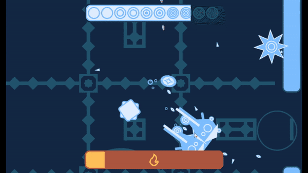

# ldjam50

you are a drop of water in a petri dish, fighting against evaporation, using tools at your disposal to sublimate, freeze, and absorb! Ludum Dare 50 [Jam submission](https://ldjam.com/events/ludum-dare/50/hydrophilia)

made in Godot

## Resources used
Stuff I used that I didn't make:
- https://www.dafont.com/bubble-2.font
- https://www.iconfinder.com/icons/216437/back_arrow_icon
- https://www.iconfinder.com/icons/353429/music_note_sound_audio_icon
- https://www.iconfinder.com/icons/5402367/audio_decrease_level_sound_volume_multimedia_icon
- https://silentwolf.com
- https://godotengine.org